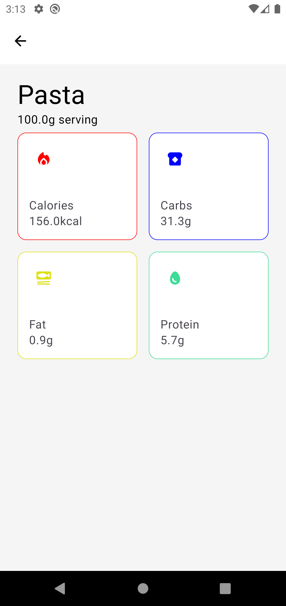

# Calorie :fire:

A sample app that showcases details of a food item built with clean architecture :sweat_smile:

## ScreenShots :artist:

|                                Calories                                 |                                Calorie                                |
|:-----------------------------------------------------------------------:|:---------------------------------------------------------------------:|
|  |  |

## Features :man_dancing:

As a user I can :

- Search for calorie details of different food items
- Have a cache of calorie items offline for later

## Modularization :musical_keyboard:

Calorie has been completely modularized and each module has it's own specific task.

|                          Modularization                           |
|:-----------------------------------------------------------------:|
|  |

## Testing :test_tube:

I wil give a more detailed testing guide later

| Module                | Test                                                                   |
|:----------------------|:-----------------------------------------------------------------------|
| `:remote`             |      |
| `:local`              |        |
| `:calories-viewmodel` |  |
| `:calorie-viewmodel`  |    |
